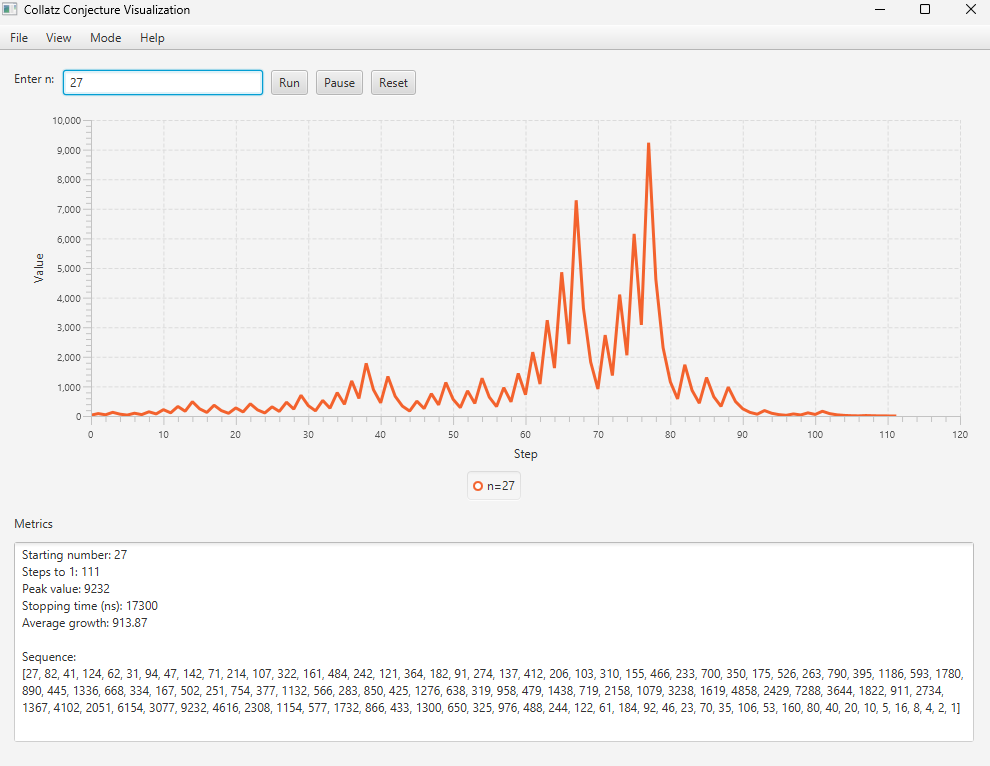
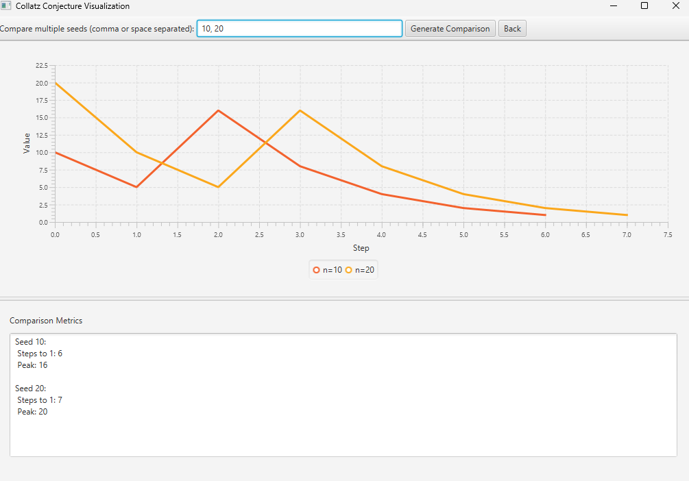

# 💻 Collatz Conjecture Visualizer

## ✨About

The Collatz Conjecture is one of the most famous unsolved problem in mathematics. It is named after the mathematician Lothar Collatz, who introduced the idea in 1937. The Collatz Conjecture suggests that if you take any positive integer and repeatedly apply a simple set of two rules, you will always eventually reach the number 1. 
* If a term is even, the next term is one half of it.
* If a term is odd, the next term is 3 times the previous term plus 1.
The conjecture is that these sequences always reach 1, no matter which positive integer is chosen to start the sequence. This has been shown to hold for all positive integers up to 2.36×10^21, but no general proof has been found.

This JavaFX application is designed to easily explore and visualize the behavior of the Collatz Conjecture. 

--------------
## 🚀 Features
* Sequence Visualization: Generates and displays the entire Collatz sequence for a given input number on a JavaFX line chart.
* Statistical Analysis: Calculates and displays key metrics for the sequence, including:
  * Peak Value: The highest number reached in the sequence.
  * Number of Steps: The total number of iterations required to reach 1.
  * Average Growth: The average value of all numbers in the sequence.
  * Stopping time: The time it takes for the application to display the Collatz Conjecture of a given number.
* User-Friendly Interface: Built using JavaFX Scene Builder for a clean user interface.
* Linear/Logarithmic Line Chart Display: Switches between linear and logarithmic line chart for a better visualization for smaller and bigger Collatz sequences.
* Data exporting (CSV): Allows the user to export key metrics data in a CSV file.
* Error Handling: Handles validation to prevent non-integers or very large n inputs and shows the corresponding warning or error messages.
* Comparison between 2 Sequences simultaneously: Displays the Collatz sequences in the same line chart, as well as key metrics for both sequences in a clear way to allow comparison between the Collatz Conjecture for 2 different inputs.
---------------
## ⚙️Getting Started: How to Run the Application: 
This section will provide you with the steps necessary to run the application.
1. Prerequisites
   Before cloning the application, ensure you have the following:
   * Java Development Kit (JDK) 17 or higher
   * JavaFX SDK
   * JavaFX Scene Builder
2. Clone the Repository
   *Open your terminal and clone the project using Git:
   *cd "path to wherever you want the project to be cloned to"
   *git clone https://github.com/ProTarafder/CollatzConjecture.git
3. Open and run the project using your IDE of preference
  
------------------------
## 📷 Screenshots/Demonstration

See the Collatz Sequence for the starting number 27:

Comparing Collatz Sequences of numbers 10 and 20:

---------------
## 👥 Team Members and Contributions:
* Abinayan Selvaratnam https://github.com/jellospyro10
* Protiti Tarafder https://github.com/ProTarafder
* Thiago Okamura https://github.com/ThiagoOkamura
---------
Link to the Trello board: https://trello.com/b/OK69jODk/programming-project
